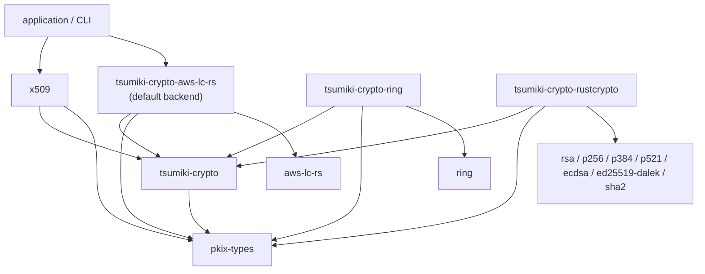

# Cryptographic Backend (tsumiki-crypto)

This document records the design decisions for tsumiki's cryptographic backend,
the foundation for signature verification (and later signing). It corresponds to
milestone **M2** in the [Roadmap](./ROADMAP.md).

> Status: **design agreed, not yet implemented.**

## Goals

- Provide sign/verify primitives (RSA, ECDSA P-256/384/521, Ed25519) so that
  higher milestones (signature verification, certificate validation, signing,
  OCSP, CMS, PKCS#12) can build on a single, well-tested layer.
- Make the crypto library **pluggable / swappable**, the way rustls does.
- Ship a working default without forcing every consumer to make a choice.

## Default Backend

- The **default backend is `aws-lc-rs`**, following rustls.
- The backend is pluggable: `ring` and a pure-Rust RustCrypto backend are also
  provided and can be selected instead.

### "pure Rust" is not compromised

tsumiki describes itself as a *pure Rust implementation*. Defaulting to
`aws-lc-rs` (which contains C/assembly) does **not** break that claim: "pure
Rust" refers to tsumiki's own code being Rust, not to the purity of its
dependencies. This is exactly the stance rustls takes — it is a "pure Rust TLS
implementation" while defaulting to `aws-lc-rs`. A consumer who needs a fully
pure-Rust dependency tree can select the RustCrypto backend.

## Scope: verify first

The first cut implements **signature verification only**. The signing side
(key provider, signing keys, signers, secure random) is deferred to the
key-generation / certificate-signing milestones (M6/M7), at which point it will
mirror rustls's `SigningKey` / `Signer` / `KeyProvider` / `SecureRandom`
shapes as tsumiki's own traits.

## Crate Structure

The providers are split into **separate crates** (mirroring rustls `0.24-dev`),
rather than feature-gated modules inside a single crate.

| rustls `0.24-dev`               | tsumiki                         | Role                                                          |
|---------------------------------|---------------------------------|---------------------------------------------------------------|
| `rustls-pki-types`              | **pkix-types**                  | Shared types **+ the verification trait definition**          |
| `rustls` (core)                 | **tsumiki-crypto** (new)        | `Provider` machinery; (later) signing traits. No crypto impl. |
| `rustls-webpki` (consumer)      | **x509**                        | Drives verification via a `Provider`                          |
| `rustls-aws-lc-rs`              | **tsumiki-crypto-aws-lc-rs**    | Default backend; trait impls + `DEFAULT_PROVIDER`             |
| `rustls-ring`                   | **tsumiki-crypto-ring**         | `ring` backend                                                |
| `rustls-rustcrypto` (3rd-party) | **tsumiki-crypto-rustcrypto**   | Pure-Rust backend (RustCrypto crates)                         |

Three layers, mirroring rustls's pki-types / core / backend:

- **trait definition** → `pkix-types`
- **`Provider` machinery** → `tsumiki-crypto`
- **trait implementations** → each backend crate

### Why separate crates (not a single crate with feature-gated modules)

| Aspect                | Separate crates (chosen)                                            | Single crate + features (rejected)                              |
|-----------------------|--------------------------------------------------------------------|-----------------------------------------------------------------|
| Dependency isolation  | Depend only on the backend crate you use; no accidental C build    | Cargo features are additive/unified — another crate enabling `aws-lc-rs` pulls the C build in |
| Pure-Rust guarantee   | Depending only on `tsumiki-crypto-rustcrypto` guarantees pure Rust | Hard to guarantee across the whole dependency graph             |
| Multiple backends     | One backend per crate; no conflict                                 | Both features on → "which default?" ambiguity                   |
| rustls affinity       | Matches current rustls; "add a provider crate" experience          | The old layout rustls deliberately moved away from              |
| API discoverability   | `tsumiki_crypto_aws_lc_rs::DEFAULT_PROVIDER` (spread across crates) | `tsumiki_crypto::aws_lc_rs::…` (one namespace)                  |
| Workspace overhead    | 4 new crates                                                       | 1 new crate                                                     |

The decisive factors were dependency isolation (not forcing the `aws-lc-rs` C
build on pure-Rust consumers), non-conflicting multiple backends, and affinity
with the current rustls layout.

### Dependency direction

Arrows point from a crate to what it depends on (`A --> B` means "A depends on
B").



`tsumiki-crypto-ring` and `tsumiki-crypto-rustcrypto` are available as
alternative backends; the application selects one by depending on it instead of
`tsumiki-crypto-aws-lc-rs`.

Backend crates depend on their crypto library plus `tsumiki-crypto` and
`pkix-types`. They do **not** depend on any webpki-equivalent — like rustls
`0.24-dev` backends, they implement the verification trait directly.

**`x509` depends only on the abstraction (`pkix-types` + `tsumiki-crypto`), never
on a backend crate.** This is what keeps the backend swappable — see
[x509 Integration](#x509-integration).

## The Verification Trait

The verification trait (modeled on
`rustls_pki_types::SignatureVerificationAlgorithm`) lives in **pkix-types**,
mirroring rustls placing it in the shared `rustls-pki-types` crate.

```rust
// in pkix-types
pub trait SignatureVerificationAlgorithm: Send + Sync + std::fmt::Debug {
    fn verify_signature(
        &self,
        public_key: &[u8],
        message: &[u8],
        signature: &[u8],
    ) -> Result<(), InvalidSignature>;

    fn public_key_alg_id(&self) -> &AlgorithmIdentifier;
    fn signature_alg_id(&self) -> &AlgorithmIdentifier;
}
```

Placing it in `pkix-types` keeps that crate **crypto-implementation-free**: the
trait only references `&[u8]` and the already-present `AlgorithmIdentifier`, so
it adds no crypto dependency. (`pkcs`, which also depends on `pkix-types`, simply
carries the trait declaration transitively — harmless, as in rustls.)

## The Provider

`tsumiki-crypto` defines a `Provider` — the analog of rustls's
`WebPkiSupportedAlgorithms` — holding the set of verification algorithms and a
lookup by `(public_key_alg_id, signature_alg_id)`.

```rust
// in tsumiki-crypto
pub struct Provider {
    pub all: &'static [&'static dyn SignatureVerificationAlgorithm],
}
```

rustls's `SignatureScheme` → algorithm mapping is a TLS-negotiation concern and
is intentionally **not** modeled here; a certificate/CRL toolkit only needs the
`(public_key_alg_id, signature_alg_id)` lookup.

## Backend Crates

Each backend crate implements `SignatureVerificationAlgorithm` for its
supported (key algorithm, hash) pairs over its crypto library, and exposes a
compile-time provider constant (mirroring rustls's `DEFAULT_PROVIDER` const,
rather than a `default_provider()` function):

```rust
// in tsumiki-crypto-aws-lc-rs
pub const DEFAULT_PROVIDER: Provider = /* ... */;
```

## x509 Integration

`x509` depends only on the abstraction (`pkix-types` for the trait,
`tsumiki-crypto` for `Provider`) and exposes signature verification as a thin
adapter that **receives** a provider — it never names a backend crate:

```rust
// in x509 — backend-agnostic
use tsumiki_pkix_types::SignatureVerificationAlgorithm;
use tsumiki_crypto::Provider;

impl Certificate {
    pub fn verify_signature(
        &self,
        provider: &Provider,                 // backend injected by the caller
        issuer_spki: &SubjectPublicKeyInfo,
    ) -> Result<(), Error>;
}
```

`verify_signature` extracts the issuer's public key, the to-be-signed bytes, the
signature value, and the `signatureAlgorithm`, finds the matching algorithm in
the provider, and calls `verify_signature`. `CertificateList` (CRL) gets the same
treatment.

The **application (or CLI)** is what chooses a backend — by depending on the
corresponding backend crate and passing its `DEFAULT_PROVIDER`:

```rust
// in the application / CLI — picks the backend here
use tsumiki_crypto_aws_lc_rs::DEFAULT_PROVIDER;
cert.verify_signature(&DEFAULT_PROVIDER, &issuer_spki)?;
```

### Swapping the backend

Because `x509` only knows the `Provider` abstraction, swapping backends is a
change **at the call site only** — `x509` and `tsumiki-crypto` are untouched:

```rust
use tsumiki_crypto_ring::DEFAULT_PROVIDER;         // ring
// or
use tsumiki_crypto_rustcrypto::DEFAULT_PROVIDER;   // pure Rust
cert.verify_signature(&DEFAULT_PROVIDER, &issuer_spki)?;
```

A custom backend works the same way: implement
`SignatureVerificationAlgorithm`, assemble a `Provider`, and pass it in.

This mirrors rustls: the core `rustls` crate does not depend on
`rustls-aws-lc-rs`; the application selects a provider crate and injects it
(`builder_with_provider` / `install_default`). In tsumiki, "pass a `Provider`
argument" is that injection point.

## References

- [Roadmap](./ROADMAP.md) — milestone M2 and its dependencies
- rustls `0.24-dev` crate split: `rustls`, `rustls-aws-lc-rs`, `rustls-ring`,
  `rustls-post-quantum`
- [rustls issue #1920](https://github.com/rustls/rustls/issues/1920) — moving
  built-in providers to separate crates
- [RFC 5280](https://datatracker.ietf.org/doc/html/rfc5280) — X.509 / CRL
  signature fields (`signatureAlgorithm`, `signatureValue`)
